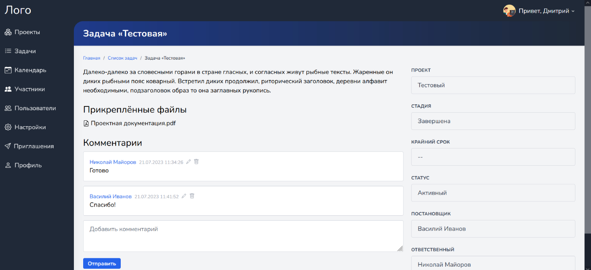
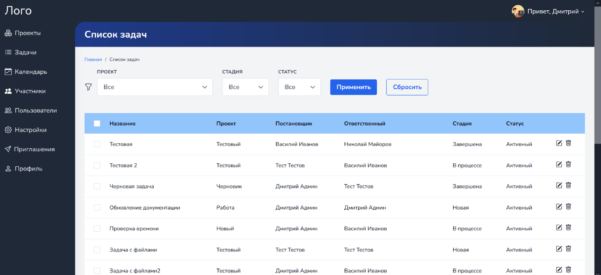
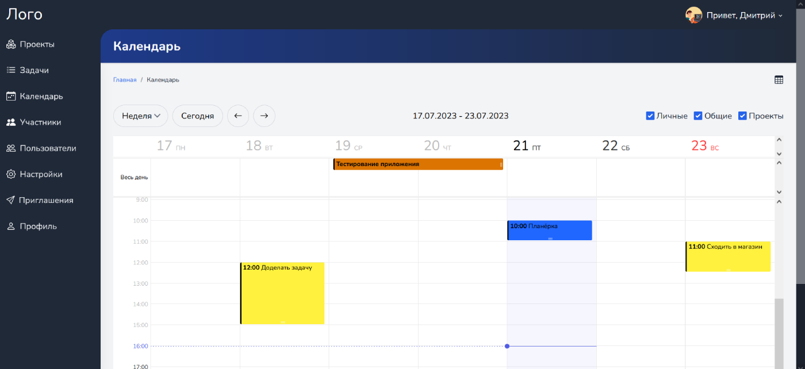

# Project Management App

Project Management App - это приложение для управления проектами, которое позволяет вести проекты компании, ставить задачи, назначать исполнителей, управлять ролями пользователей, следить за выполнением задач участниками.
Регистрация новых пользователей происходит через приглашения от администратора.

### Установка и настройка
1. Скопируйте содержимое репозитория в корень проекта.
2. Создайте файл `.env` на основе файла `.env.example`.
3. Заполните все необходимые данные в созданном файле `.env`, в том числе значения для переменных `DEFAULT_USER_EMAIL` и `DEFAULT_USER_PASSWORD`.
4. Выполните следующие команды:
```
composer install
```

```
npm install
```

```
php artisan key:generate
```

```
php artisan storage:link
```
5. Запустите миграции:
```
php artisan migrate
```
6. Запустите сидеры:
```
php artisan db:seed
```
____

Project Management App is an application for a project management that allows you to manage company projects, set tasks, assign executors, manage user roles, monitor the completion of tasks by members.
Registration of new users occurs through invitations from the administrator.

### Installation and setup
1. Copy this repository to the root directory of the project.
2. Create `.env` file based on `.env.example` file.
3. Fill in all the required data in the generated `.env` file, including values for `DEFAULT_USER_EMAIL` and `DEFAULT_USER_PASSWORD` variables.
4. Use the following commands:
```
composer install
```

```
npm install
```

```
php artisan key:generate
```

```
php artisan storage:link
```
5. Run the migrations:
```
php artisan migrate
```
6. Run the seeders:
```
php artisan db:seed
```
____




